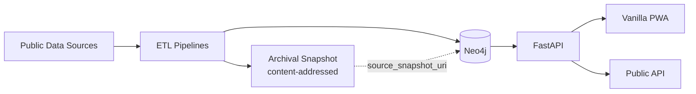

# Fiscal Cidadão

[English](README.md) | [Português (Brasil)](docs/pt-BR/README.md)

**Open-source graph infrastructure that cross-references public databases from the state of Goiás (Brazil) to make fiscal data more accessible to citizens.**

[](https://www.gnu.org/licenses/agpl-3.0)

> **Fork notice.** Fiscal Cidadão is a fork of the upstream project [`brunoclz/br-acc`](https://github.com/brunoclz/br-acc) ("br/acc open graph"), licensed under **AGPL v3**. This fork is being **re-scoped to Goiás only** and rebranded as **Fiscal Cidadão**. Attribution and license are preserved in full — see [`LICENSE`](LICENSE). Branding changes here are user-facing only: internal package names (`bracc`, `bracc_etl`, `bracc-etl` CLI) remain identical to upstream to keep API, import paths, and tooling compatible.

---

## What is Fiscal Cidadão?

Fiscal Cidadão is an open-source graph infrastructure that ingests official Brazilian public databases — with emphasis on **Goiás-specific sources** (Câmara de Goiânia, Folha GO, SIOP transfers to GO, IBAMA embargoes in GO, etc.) — and normalizes them into a single queryable graph.

It makes public data that is already open but scattered across dozens of portals accessible in one place. It does not interpret, score, or rank results — it surfaces connections and lets users draw their own conclusions.

The long-term goal is a civic-focused platform for residents of Goiás to consult public spending, tenders, environmental records, and legislative activity in a unified interface. Federal datasets remain ingested where they add context for Goiás-based entities.

---

## Features

- **ETL pipeline modules** — 62 pipelines in `etl/src/bracc_etl/pipelines/`, status tracked in `docs/source_registry_br_v1.csv` (loaded/partial/stale/blocked/not_built), including Goiás-specific sources (`camara_goiania`, `folha_go`, `mides`, `siop`, `tcm_go`, `alego`, `camara_politicos_go`, `emendas_parlamentares_go`, `tse_prestacao_contas_go`, `querido_diario_go`, etc.)
- **Content-addressed archival layer** — `bracc_etl.archival` snapshots every HTTP payload at ingestion time; `source_snapshot_uri` is stamped on the `ProvenanceBlock` so every fact shown to the user stays verifiable even if the upstream portal changes or goes offline (see [`docs/archival.md`](docs/archival.md)).
- **Neo4j graph infrastructure** — schema, loaders, and query surface for normalized entities and relationships
- **FastAPI backend** — single async backend in `api/` (the legacy Flask `backend/` service was removed; FastAPI now serves all PWA-parity endpoints directly)
- **Vanilla PWA frontend** — `pwa/` (single-page HTML/JS app, served via nginx in prod)
- **Automated civic alerts** — see [Automated alerts](#automated-alerts) below
- **Public API** — programmatic access to graph data via FastAPI
- **Reproducibility tooling** — one-command local bootstrap plus BYO-data ETL workflow
- **Privacy-first** — LGPD compliant, public-safe defaults, no personal data exposure

---

## Quick Start

```bash
cp .env.example .env
docker compose up -d --build
bash infra/scripts/seed-dev.sh
```

This flow starts the Docker stack from the repository root and then loads deterministic development seed data into Neo4j.

Verify with:

- API: http://localhost:8000/health
- API Docs: http://localhost:8000/docs
- Frontend (PWA): open `pwa/index.html` in a browser (dev) or serve through the nginx container from `docker-compose.prod.yml` (prod)
- Neo4j Browser: http://localhost:7474

### Starting with Docker

You can start the stack (Neo4j + FastAPI) with Docker Compose without running the full bootstrap. The PWA is static and can be served either by opening `pwa/index.html` directly in dev, or via the nginx service in `docker-compose.prod.yml` in production:

```bash
cp .env.example .env
docker compose up -d
```

Optional: include the ETL service (for running pipelines in a container):

```bash
docker compose --profile etl up -d
```

Same verification URLs apply. For a ready-to-use demo graph with seed data, use `make bootstrap-demo` instead.

---

## One-Command Flow

```bash
# Start all core services (Neo4j + API + Frontend)
docker compose up -d --build

# Load deterministic demo seed
bash infra/scripts/seed-dev.sh

# Include ETL service when needed
docker compose --profile etl up -d --build

# Stop stack
docker compose down

# Heavy full ingestion orchestration (all implemented pipelines)
make bootstrap-all

# Noninteractive heavy run (automation)
make bootstrap-all-noninteractive

# Print latest bootstrap-all report
make bootstrap-all-report
```

`make bootstrap-all` is intentionally heavy:
- full historical default ingestion target
- can take hours (or longer) depending on source availability
- requires substantial disk, memory, and network bandwidth
- continues on errors and writes auditable per-source status summary under `audit-results/bootstrap-all/`

Detailed guide: [`docs/bootstrap_all.md`](docs/bootstrap_all.md)

---

## What Is Included In This Public Repo

- API, frontend, ETL framework, and infrastructure code.
- Source registry and pipeline status documentation.
- Synthetic demo dataset and deterministic local seed path.
- Public safety/compliance gates and release governance docs.

## What Is Not Included By Default

- A pre-populated production Neo4j dump.
- Guaranteed uptime/stability of every third-party public portal.
- Institutional/private modules and operational runbooks.

## What Is Reproducible Locally Today

- Full local stack startup (`docker compose up -d --build`) with demo graph seed (`bash infra/scripts/seed-dev.sh`).
- BYO-data ingestion workflow through `bracc-etl` pipelines (CLI name preserved from upstream).
- One-command heavy orchestration (`make bootstrap-all`) with explicit blocked/failed source reporting.
- Public-safe API behavior with privacy defaults.

Production-scale counters are published as a **reference production snapshot** in [`docs/reference_metrics.md`](docs/reference_metrics.md), not as expected local bootstrap output.

---

## Architecture

| Layer | Technology |
|---|---|
| Graph DB | Neo4j 5 Community |
| Backend | FastAPI (Python 3.12+, async) — single backend; legacy Flask `backend/` deleted |
| Frontend | Vanilla PWA (`pwa/index.html` + `sw.js`, served via nginx in prod) |
| ETL | Python (pandas, httpx) + content-addressed archival (`bracc_etl.archival`) |
| Provenance | Every persisted node/edge carries `source_id`, `source_record_id`, `source_url`, `ingested_at`, `run_id` + optional `source_snapshot_uri` ([contract](docs/provenance.md)) |
| Infra | Docker Compose |



The FastAPI backend is organised around 17 services under `api/src/bracc/services/` (perfil, conexoes, despesas, emendas, alertas, analise, validacao_tse, teto, formatacao, traducao, rfb_status, …) and exposes the PWA-parity routes (`/status`, `/buscar-tudo`, `/politico/{id}`) via `bracc.routers.pwa_parity`.

---

## Repository Map

```
api/          FastAPI backend (routes, services, models) — the only backend
etl/          ETL pipelines, download scripts, and content-addressed archival
pwa/          Vanilla PWA (index.html, manifest.json, service worker)
infra/        Docker, Neo4j schema, seed scripts
scripts/      Utility and automation scripts
docs/         Documentation, brand assets, legal index
data/         Downloaded datasets (git-ignored)
```

Internal Python packages (`bracc`, `bracc_etl`) and the `bracc-etl` CLI retain their upstream names to preserve import-path compatibility with `brunoclz/br-acc`.

---

## API Reference

| Method | Route | Description |
|---|---|---|
| GET | `/health` | Health check |
| GET | `/api/v1/public/meta` | Aggregated metrics and source health |
| GET | `/api/v1/public/graph/company/{cnpj_or_id}` | Public company subgraph |
| GET | `/api/v1/public/patterns/company/{cnpj_or_id}` | Pattern analysis (when enabled) |
| GET | `/politico/{entity_id}` | Full `PerfilPolitico` (22 top-level fields: alertas, emendas, doadores empresa/pessoa, sócios, família, contratos, despesas_gabinete, comparacao_cidada, validacao_tse, teto_gastos, status_contas_tse, …) |

Full interactive docs available at `http://localhost:8000/docs` after starting the API.

---

## Automated alerts

Fiscal Cidadão computes a short list of deterministic, source-attributed alerts on every `/politico/{entity_id}` call. Nothing is inferred by an ML model — every alert is a rule over data already ingested, and every alert carries a reference to the underlying fact (and its `source_url` / `source_snapshot_uri`) so users can verify it themselves.

Current signals (from `api/src/bracc/services/alertas_service.py`):

| Signal | Severity | Legal / source basis |
|---|---|---|
| Campaign donor with RFB status `BAIXADA`, `SUSPENSA`, or `INAPTA` | `grave` | BrasilAPI RFB snapshot (`brasilapi_cnpj_status` pipeline), cached 7 days |
| Campaign spending over the legal ceiling | `grave` / `atencao` | TSE Resolução 23.607/2019 (`teto_service`) |
| TSE accounts judged `desaprovada` / `nao_prestada` | `grave` | TSE `prestacao_contas` (placeholder until `status_contas_tse` is fully wired) |
| Gabinete spending well above peer cohort average | `atencao` | Câmara CEAP + peer aggregation (`despesas_service`) |
| Monthly spending spikes on CEAP | `atencao` | Câmara CEAP time series |
| Patrimônio evolution inconsistent with declared income | `atencao` | TSE bens declarados (`analisar_patrimonio`) |
| Emendas concentration on a single supplier | `atencao` | Portal da Transparência + SIOP |

Three-tier "how much does this politician cost us?" coverage:

- **Federal** — CEAP (cota para exercício da atividade parlamentar)
- **State (Goiás)** — ALEGO verba indenizatória
- **Municipal (Goiânia)** — Câmara Municipal cota

---

## Contributing

See [`CONTRIBUTING.md`](CONTRIBUTING.md). Contributions of all kinds are welcome — code, data pipelines, documentation, and bug reports. Given the Goiás scope of this fork, pipelines and documentation that improve GO-specific data coverage are especially appreciated.

---

## Upstream Attribution

Fiscal Cidadão is derived from **[`brunoclz/br-acc`](https://github.com/brunoclz/br-acc)** by Bruno Clezar and the br/acc contributors. The upstream project is a broader federal-scope initiative; this fork narrows focus to the state of Goiás and adopts the name "Fiscal Cidadão" for user-facing contexts while preserving all copyright notices and the AGPL v3 license.

Upstream contributors: [`brunoclz/br-acc` contributors](https://github.com/brunoclz/br-acc/graphs/contributors).

---

## Legal & Ethics

All data processed by this project is public by law. Every source is published by a Brazilian government portal or international open-data initiative and made available under one or more of the following legal instruments:

| Law | Scope |
|---|---|
| **CF/88 Art. 5 XXXIII, Art. 37** | Constitutional right to access public information |
| **Lei 12.527/2011 (LAI)** | Freedom of Information Act — regulates access to government data |
| **LC 131/2009 (Lei da Transparência)** | Mandates real-time publication of fiscal and budget data |
| **Lei 13.709/2018 (LGPD)** | Data protection — Art. 7 IV/VII allow processing of publicly available data for public interest |
| **Lei 14.129/2021 (Governo Digital)** | Mandates open data by default for government agencies |

All findings are presented as source-attributed data connections, never as accusations. The platform enforces public-safe defaults that prevent exposure of personal information in public deployments.

<details>
<summary><b>Public-safe defaults</b></summary>

```
PRODUCT_TIER=community
PUBLIC_MODE=true
PUBLIC_ALLOW_PERSON=false
PUBLIC_ALLOW_ENTITY_LOOKUP=false
PUBLIC_ALLOW_INVESTIGATIONS=false
PATTERNS_ENABLED=false
VITE_PUBLIC_MODE=true
VITE_PATTERNS_ENABLED=false
```
</details>

- [ETHICS.md](ETHICS.md)
- [LGPD.md](LGPD.md)
- [PRIVACY.md](PRIVACY.md)
- [TERMS.md](TERMS.md)
- [DISCLAIMER.md](DISCLAIMER.md)
- [SECURITY.md](SECURITY.md)
- [ABUSE_RESPONSE.md](ABUSE_RESPONSE.md)
- [Legal Index](docs/legal/legal-index.md)

---

## License

[GNU Affero General Public License v3.0](LICENSE) — inherited from upstream `brunoclz/br-acc`.
