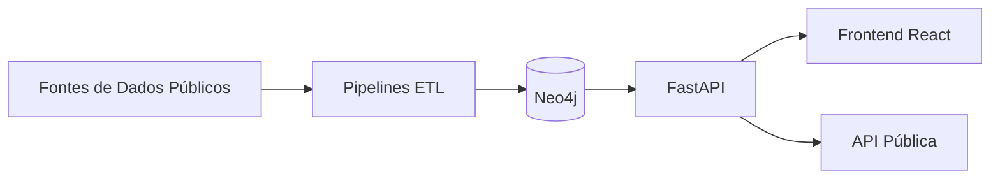

# Fiscal Cidadão

[English](../../README.md) | [Português (Brasil)](README.md)

**Infraestrutura open-source em grafo que cruza bases públicas do estado de Goiás para tornar dados fiscais mais acessíveis à cidadania.**

[](https://www.gnu.org/licenses/agpl-3.0)

> **Aviso de fork.** Fiscal Cidadão é um fork do projeto upstream [`brunoclz/br-acc`](https://github.com/brunoclz/br-acc) ("br/acc open graph"), licenciado sob **AGPL v3**. Este fork está sendo **reescopado para Goiás apenas** e rebrandeado como **Fiscal Cidadão**. A atribuição e a licença são preservadas integralmente — ver [`LICENSE`](../../LICENSE). As mudanças de marca aqui são apenas user-facing: nomes internos de pacotes (`bracc`, `bracc_etl`, CLI `bracc-etl`) permanecem idênticos ao upstream para manter compatibilidade de API, imports e tooling.

---

## O que é Fiscal Cidadão?

Fiscal Cidadão é uma infraestrutura open-source em grafo que ingere bases públicas oficiais brasileiras — com ênfase em **fontes específicas de Goiás** (Câmara de Goiânia, Folha GO, repasses SIOP para GO, embargos IBAMA em GO, etc.) — e normaliza tudo em um único grafo consultável.

Torna dados públicos que já são abertos, mas espalhados em dezenas de portais, acessíveis em um só lugar. Não interpreta, pontua ou classifica resultados — apenas exibe conexões e deixa os usuários tirarem suas próprias conclusões.

O objetivo de longo prazo é uma plataforma cívica focada em cidadãos de Goiás para consulta de gastos públicos, licitações, registros ambientais e atividade legislativa em uma interface unificada. Datasets federais continuam sendo ingeridos quando agregam contexto para entidades baseadas em Goiás.

---

## Funcionalidades

- **Módulos ETL implementados** — status rastreado em `docs/source_registry_br_v1.csv` (loaded/partial/stale/blocked/not_built), incluindo pipelines específicos de Goiás (`camara_goiania`, `folha_go`, `mides`, `siop`, etc.)
- **Infraestrutura de grafo Neo4j** — schema, loaders e superfície de consulta para entidades e relacionamentos
- **Frontend React** — busque e explore redes e conexões entre entidades
- **API pública** — acesso programático aos dados do grafo via FastAPI
- **Ferramentas de reprodutibilidade** — bootstrap local em um comando e fluxo BYO-data para ETL
- **Privacy-first** — compatível com LGPD, defaults públicos seguros, sem exposição de dados pessoais

---

## Início Rápido

```bash
cp .env.example .env
make bootstrap-demo
```

Esse comando inicia os serviços Docker, espera Neo4j/API ficarem saudáveis e carrega seed determinístico de desenvolvimento.

Verifique em:

- API: http://localhost:8000/health
- Frontend: http://localhost:3000
- Neo4j Browser: http://localhost:7474

### Subir com Docker

Você pode subir a stack (Neo4j, API, frontend) com Docker Compose sem rodar o bootstrap completo:

```bash
cp .env.example .env
docker compose up -d
```

Opcional: incluir o serviço ETL (para rodar pipelines no container):

```bash
docker compose --profile etl up -d
```

As mesmas URLs de verificação valem. Para um grafo demo pronto com dados de seed, use `make bootstrap-demo`.

---

## Fluxo Em Um Comando

```bash
# Fluxo demo local (recomendado para primeira execução)
make bootstrap-demo

# Orquestração pesada de ingestão completa (Docker + todos pipelines implementados)
make bootstrap-all

# Execução pesada não interativa (automação)
make bootstrap-all-noninteractive

# Exibir último relatório do bootstrap-all
make bootstrap-all-report
```

`make bootstrap-all` é propositalmente pesado:
- alvo padrão de ingestão histórica completa
- pode levar horas (ou mais), dependendo das fontes externas
- exige disco, memória e banda de rede significativos
- continua em caso de erro e grava resumo auditável por fonte em `audit-results/bootstrap-all/`

Guia detalhado: [`docs/bootstrap_all.md`](../bootstrap_all.md)

---

## O Que Esta Incluido Neste Repositorio Publico

- Código de API, frontend, framework ETL e infraestrutura.
- Registro de fontes e documentação de status de pipelines.
- Dataset demo sintético e caminho determinístico de seed local.
- Gates públicos de segurança/compliance e documentação de release.

## O Que Nao Esta Incluido Por Padrao

- Dump Neo4j de produção pré-populado.
- Garantia de estabilidade/disponibilidade de todos os portais externos.
- Módulos institucionais/privados e runbooks operacionais internos.

## O Que E Reproduzivel Localmente Hoje

- Subida completa local (`make bootstrap-demo`) com grafo demo.
- Fluxo BYO-data via pipelines `bracc-etl` (nome do CLI preservado do upstream).
- Orquestração pesada em um comando (`make bootstrap-all`) com relatório explícito de fontes bloqueadas/falhas.
- Comportamento da API pública em modo seguro de privacidade.

Contadores de escala de produção são publicados como **snapshot de referencia de producao** em [`docs/reference_metrics.md`](../reference_metrics.md), não como resultado esperado do bootstrap local.

---

## Arquitetura

| Camada | Tecnologia |
|---|---|
| Banco de Grafo | Neo4j 5 Community |
| Backend | FastAPI (Python 3.12+, async) |
| Frontend | Vite + React 19 + TypeScript |
| ETL | Python (pandas, httpx) |
| Infra | Docker Compose |



---

## Mapa do Repositório

```
api/          Backend FastAPI (rotas, serviços, modelos)
etl/          Pipelines ETL e scripts de download
frontend/     App React (Vite + TypeScript)
infra/        Docker, schema Neo4j, scripts de seed
scripts/      Scripts utilitários e de automação
docs/         Documentação, assets de marca, índice legal
data/         Datasets baixados (ignorado pelo git)
```

Pacotes Python internos (`bracc`, `bracc_etl`) e a CLI `bracc-etl` mantêm os nomes do upstream para preservar compatibilidade de import paths com `brunoclz/br-acc`.

---

## Referência da API

| Método | Rota | Descrição |
|---|---|---|
| GET | `/health` | Health check |
| GET | `/api/v1/public/meta` | Métricas agregadas e saúde das fontes |
| GET | `/api/v1/public/graph/company/{cnpj_or_id}` | Subgrafo público de empresa |
| GET | `/api/v1/public/patterns/company/{cnpj_or_id}` | Análise de padrões (quando habilitado) |

Documentação interativa completa em `http://localhost:8000/docs` após iniciar a API.

---

## Contribuindo

Veja [`CONTRIBUTING.md`](CONTRIBUTING.md). Contribuições de todos os tipos são bem-vindas — código, pipelines de dados, documentação e relatos de bugs. Dado o escopo Goiás deste fork, pipelines e documentação que melhorem a cobertura de dados específicos de GO são especialmente bem-vindos.

---

## Atribuição ao Upstream

Fiscal Cidadão é derivado de **[`brunoclz/br-acc`](https://github.com/brunoclz/br-acc)** de Bruno Clezar e dos contribuidores do br/acc. O projeto upstream é uma iniciativa federal de escopo mais amplo; este fork estreita o foco para o estado de Goiás e adota o nome "Fiscal Cidadão" em contextos user-facing, preservando todos os avisos de copyright e a licença AGPL v3.

Contribuidores upstream: [`brunoclz/br-acc` contributors](https://github.com/brunoclz/br-acc/graphs/contributors).

---

## Legal e Ética

Todos os dados processados por este projeto são públicos por lei. Cada fonte é publicada por um portal do governo brasileiro ou iniciativa internacional de dados abertos, disponibilizada sob um ou mais dos seguintes instrumentos legais:

| Lei | Escopo |
|---|---|
| **CF/88 Art. 5 XXXIII, Art. 37** | Direito constitucional de acesso à informação pública |
| **Lei 12.527/2011 (LAI)** | Lei de Acesso à Informação — regula o acesso a dados governamentais |
| **LC 131/2009 (Lei da Transparência)** | Obriga publicação em tempo real de dados fiscais e orçamentários |
| **Lei 13.709/2018 (LGPD)** | Proteção de dados — Art. 7 IV/VII permitem tratamento de dados públicos para interesse público |
| **Lei 14.129/2021 (Governo Digital)** | Obriga dados abertos por padrão para órgãos governamentais |

Todos os achados são apresentados como conexões de dados atribuídas a fontes, nunca como acusações. A plataforma aplica defaults públicos seguros que impedem exposição de informações pessoais em deployments públicos.

<details>
<summary><b>Defaults públicos seguros</b></summary>

```
PRODUCT_TIER=community
PUBLIC_MODE=true
PUBLIC_ALLOW_PERSON=false
PUBLIC_ALLOW_ENTITY_LOOKUP=false
PUBLIC_ALLOW_INVESTIGATIONS=false
PATTERNS_ENABLED=false
VITE_PUBLIC_MODE=true
VITE_PATTERNS_ENABLED=false
```
</details>

- [ETHICS.md](../../ETHICS.md)
- [LGPD.md](../../LGPD.md)
- [PRIVACY.md](../../PRIVACY.md)
- [TERMS.md](../../TERMS.md)
- [DISCLAIMER.md](../../DISCLAIMER.md)
- [SECURITY.md](../../SECURITY.md)
- [ABUSE_RESPONSE.md](../../ABUSE_RESPONSE.md)
- [Índice Legal](../legal/legal-index.md)

---

## Licença

[GNU Affero General Public License v3.0](../../LICENSE) — herdada do upstream `brunoclz/br-acc`.
